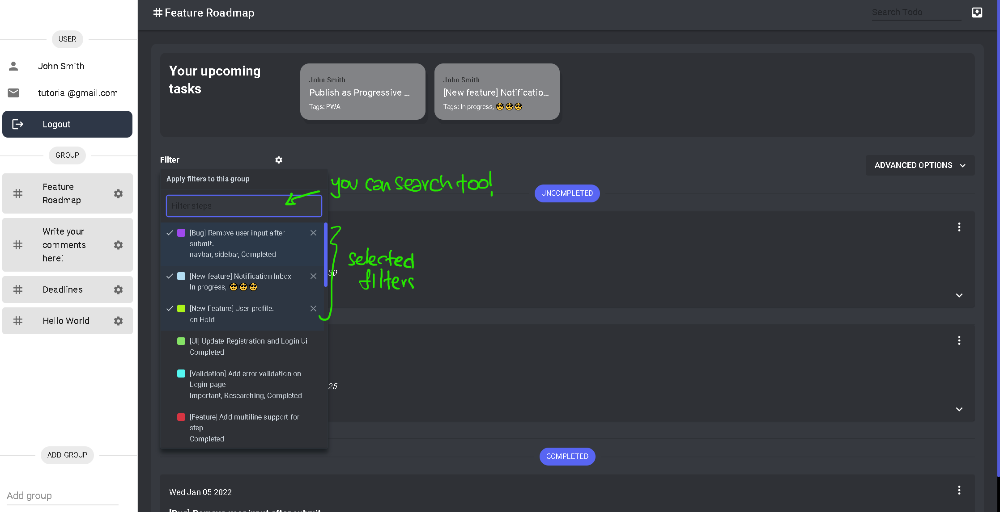

# Feature 1: Filter Component

Over time, there may be too many steps to keep track of. Here, we introduce the filter component to save you the trouble of scrolling through the page.

:::tip

Also note that you can _literally_ search for anything. From steps to tags, the application will find it! No matter!
:::
