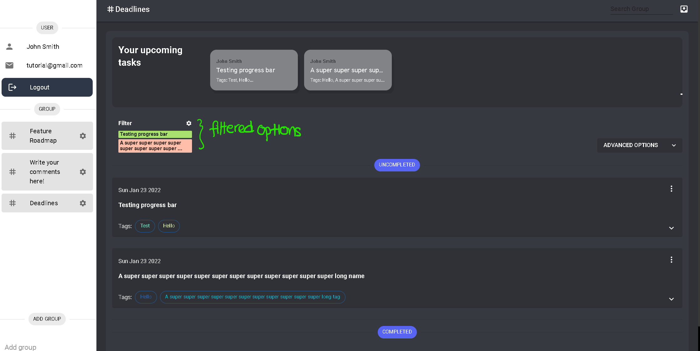

# Feature 1: Filter Component

Over time, there may be too many steps to keep track of. Here, we introduce the filter component to save you the trouble of scrolling through the page. You can also search via the input field!

First, select (or search!) the steps that you wish to view.

:::tip

Also note that you can _literally_ search for anything. From steps to tags, the application will find it! No matter!
:::

Click anywhere outside the filter and this is how it will look. _Colorful eh? _

