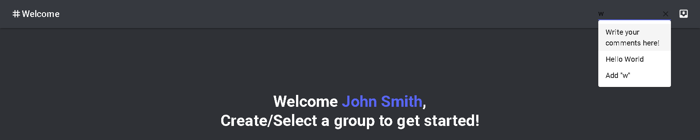
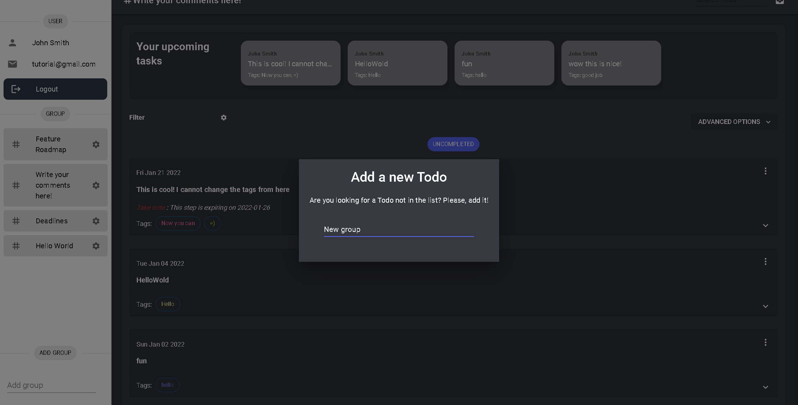

# Feature 2: Search Functionality

Located at the top right hand corner, you will see a search bar. When you click the search bar, the application will automatically generate a list of current groups. You can click any one of those to navigate to that directory.

Not only that, but you can create groups directly from the search bar. Here's an example:

:::info

On enter, a modal will appear, with **synced inputfield**.

Then, the new group will appear on the left sidebar.

:::
