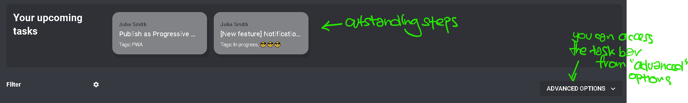

# Feature 4: Task bars

Task bars is an easy way to keep track of your outstanding steps. Simply click on them to complete the step!

:::note
Do note that these steps are sorted in order of their priority!
:::

An example (no upcoming steps):

