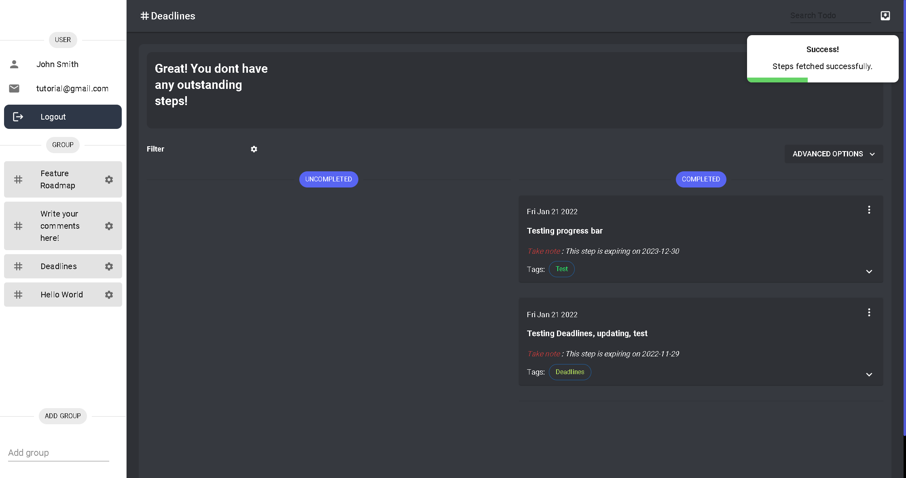

# Feature 4: Drag and Drop tasks

Task bars is an easy way to keep track of your outstanding steps. Simply click on them to complete the step!

:::info
The task bar supports drag and drop. Give it a try!
:::

:::note
Do note that these steps are sorted in order of their priority!
:::

An example (no upcoming steps):

