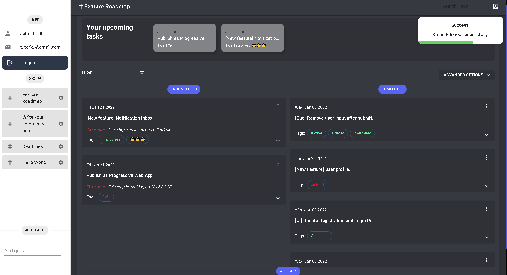
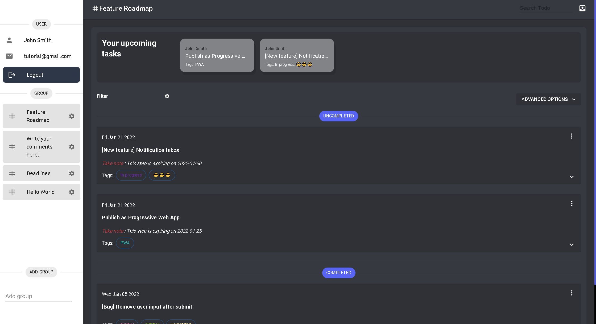

# Feature 5: Different view layout

Different view modes appeal to different users base. Here, we add two different view mode.

:::info

You can change the view by navigating to relevant option under "Advanced Options".

:::

Grid view:

Layered view:

Which one suits you _better_? 😎😋
