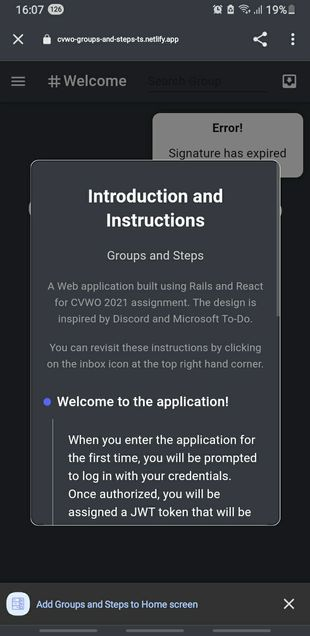
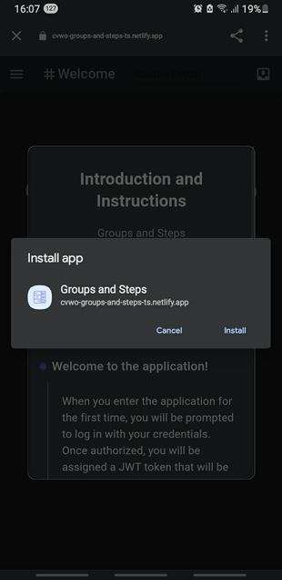
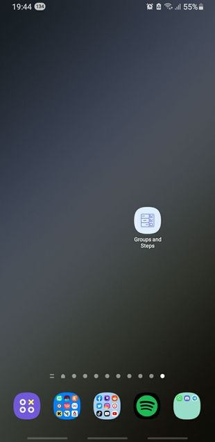

# Feature 8: Progressive Web Application

The _entire_ idea behind this application is to grow along with you. Hence, the decision to make it a progressive web app. With this, on each release, you will be notified to download the new version. Also, you can now install the web app on both your laptops and mobile phones!

**On desktop**

To install, first look for the download icon on the top right of your laptop. Once found, click on download. This is how it looks after you've download.

You should also be able to find a copy of the web application on your desktop.

This is how it looks like after opening it locally.

**On mobile**

When you enter the application for the first time, there will be a prompt at the bottom of your screen to download the application.
Click on install and you should see the icon in your apps directory.

Cool, _isn't it_?
