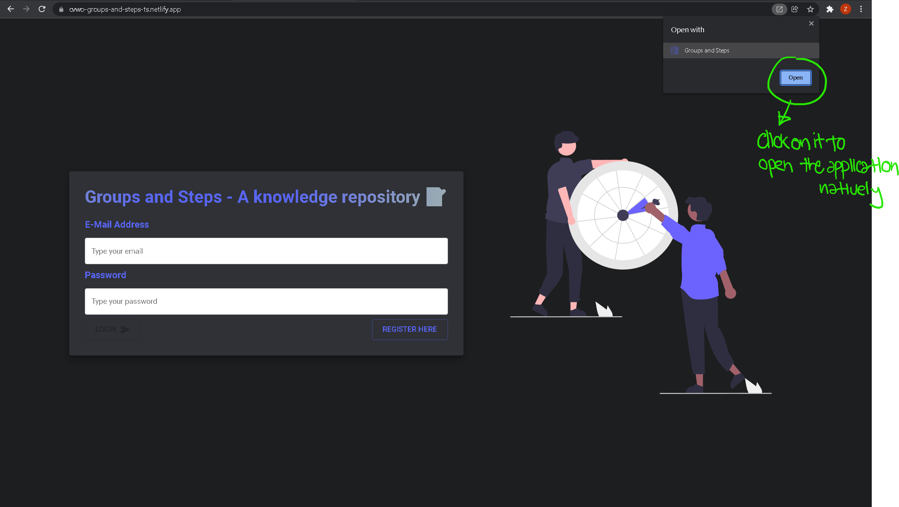
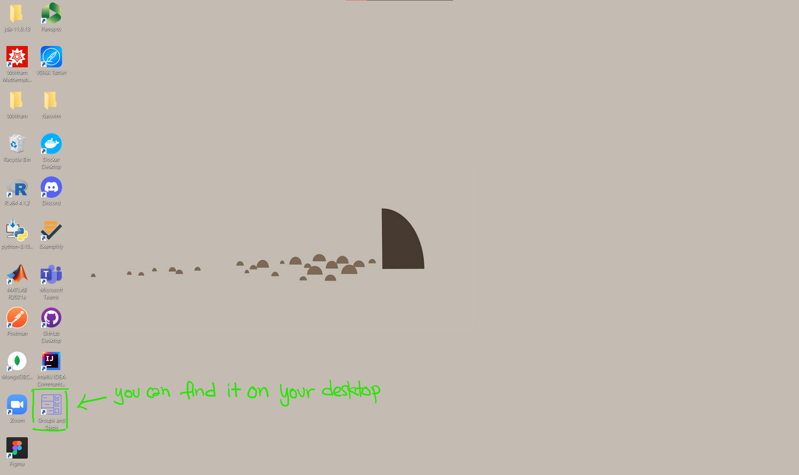
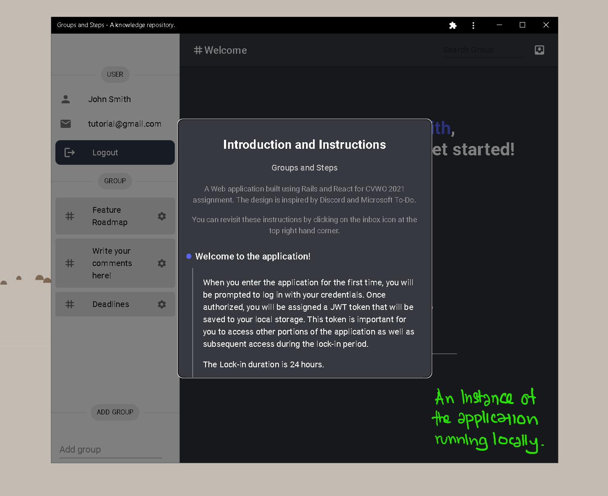

# Feature 8: Progressive Web Application

The main goal of this application is to grow as you do. Hence, the decision to make it a progressive web app. With this, on each release, you will be notified to download the new version. Also, you can now install the web app on both your laptops and mobile phones!

To install, first look for the download icon on the top right of your laptop. Once found, click on download. This is how it looks after you've download.

You should also be able to find a copy of the web application on your desktop.

This is how it looks like after opening it locally.

Cool, _isn't it_?
