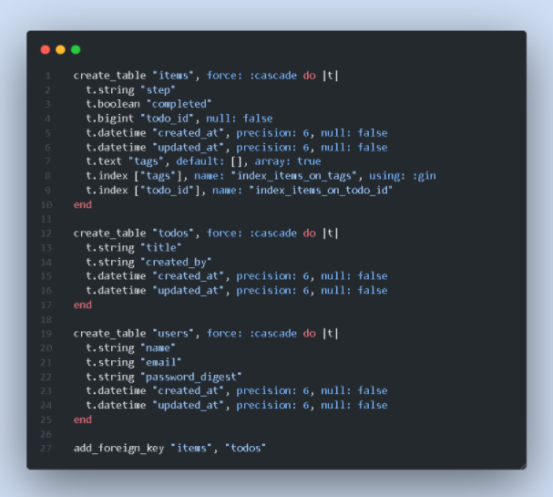
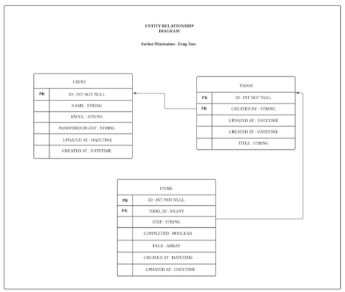

# CVWO Riding on Rails 2021/2022 Mid-Winter Assignment Submission

By Lee Zong Xun

This submission details the user stories and use cases for the application, database implementation with rails and plans for the upcoming month.

Github Submission Repo: [Frontend Repo](https://github.com/Zxun2/cvwo-assignment-frontend), [Backend Repo](https://github.com/Zxun2/cvwo-assignment-backend)

---

## Overview

Groups and Steps 📝 is a web application built using Rails and React for CVWO 2021/2022 assignment. It allows you to manage your tasks into groups, and further break them down into steps.

## Architecture

This application adopted the use of MVC architecture for the backend and Flux architecture for the frontend.

## Database Choice and design

**PostgreSQL**

Implemented with Rails.

**Schema**

**Modeling Relationship (One to Many)**

## User Story

### Description

As an app user, I would like to use the application as a central knowledge and task management platform. So that i can plan my tasks effectively and efficiently.

### Acceptance Criteria

Build a task management application to allow real-time tasks updates and management. Allow users to perform basic CRUDs functionalities, a tagging system to categorise tasks and a search functionality to navigate between groups.

:::caution
Notes
CRUDS functionality is dependent on API availability & integration.
:::

## Use Cases

#### Create a group

import Tabs from '@theme/Tabs';
import TabItem from '@theme/TabItem';

<Tabs>
  <TabItem value="Positive Response" label="Positive Response">A new thread of steps will be created. Users will be prompted to start on their steps.</TabItem>
  <TabItem value="Negative Response" label="Negative Response">Unable to create a group. Error message.</TabItem>
</Tabs>

#### Edit and Delete a group

<Tabs>
  <TabItem value="Positive Response" label="Positive Response">Group's title will automatically be updated/deleted. All steps relevant to the group will also be deleted.</TabItem>
  <TabItem value="Negative Response" label="Negative Response">Error message.</TabItem>
</Tabs>

#### Create a step

<Tabs>
  <TabItem value="Positive Response" label="Positive Response">User will begin to input steps to track their tasks.</TabItem>
  <TabItem value="Negative Response" label="Negative Response">Unable to create step. Error message.</TabItem>
</Tabs>

#### Editing and Deleting a step

<Tabs>
  <TabItem value="Positive Response" label="Positive Response">Step's name will be updated/deleted accordingly.</TabItem>
  <TabItem value="Negative Response" label="Negative Response">Error message.</TabItem>
</Tabs>

#### Search for groups

<Tabs>
  <TabItem value="Positive Response" label="Positive Response">If a group exists, the user will be directed to the page containing the group's information. Otherwise, the user will be prompted to create a new group.</TabItem>
  <TabItem value="Negative Response" label="Negative Response">No error message.</TabItem>
</Tabs>

#### Filter steps

<Tabs>
  <TabItem value="Positive Response" label="Positive Response">User will be able to filter the steps according to any keyword they typed in. Successful filters will filter the steps accordingly.</TabItem>
  <TabItem value="Negative Response" label="Negative Response">No error message.</TabItem>
</Tabs>

#### Adding tags

<Tabs>
  <TabItem value="Positive Response" label="Positive Response">Tags added will be placed right beside the input box.</TabItem>
  <TabItem value="Negative Response" label="Negative Response">No error message.</TabItem>
</Tabs>

## Reflection

So far, the experience has been absolutely amazing. Despite the numerous ups and downs, debugging, and internal screaming, I am really satisfied with the outcome of my mid-submission. While I had previous web programming experience (through my club activities), I had never built a full-stack web application from scratch nor have I worked with Ruby on Rails.
As a result, the majority of my time was spent learning Rails syntax, reading documentation, and constructing the backend. Setting up the Linux Environment was also difficult, and I had to use Stack Overflow to debug several of the difficulties. Adopting the MVC design for the backend and the Flux architecture for the frontend has opened up my eyes to the many software engineering paradigms, particularly the notion of state management. Using Redux has made it exceedingly simple to maintain track of app-wide state with a single source of truth. This mid-assignment has helped me to further hone my understanding of web programming, and I intend to further improve it with the following features in the coming month.

## Intended improvements over the next month

- Implement other ancillary enhancements (i.e markdown and code support)

- Introduce testing

- Refactor to Typescript
