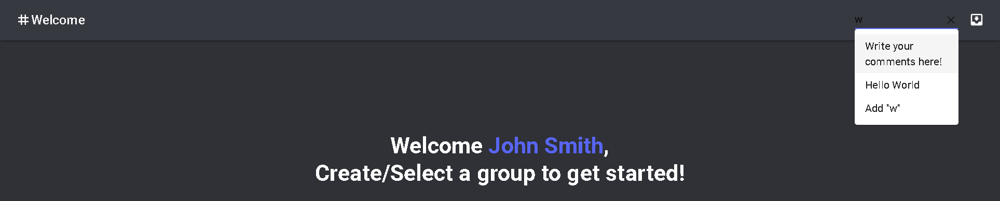

# Features

Features! Here we are. I wonder what cool things this application holds⁉⁉⁉

## Feature 1: Filter Component

Over time, there may be too many steps to keep track of. Here, we introduce the filter component to save you the trouble of scrolling through the page.

:::tip

Also note that you can _literally_ search for anything. From steps to tags, the application will find it! No matter!
:::

## Feature 2: Search Functionality

Located at the top right hand corner, you will see a search bar. When you click the search bar, the application will automatically generate a list of current groups. You can click any one of those to navigate to that directory.

Not only that, but you can create groups directly from the search bar. Here's an example:

:::info

On enter, a modal will appear, with **synced inputfield**.

Then, the new group will appear on the left sidebar.

:::

## Feature 2: Filter Component

Over time, there may be too many steps to keep track of. Here, we introduce the filter component to save you the trouble of scrolling through the page.

:::tip

Also note that you can _literally_ search for anything. From steps to tags, the application will find it! No matter!
:::

## Feature 3: Foldable Columns

To make things easy to navigate (from one category to the other), there is the foldable columns.

Now, this is how it looks like when folded.

## Feature 4: Task bars

Task bars is an easy way to keep track of your outstanding tasks. Simply click on them to complete the step!

Do note that these steps are sorted in order of their priority!

An example (no upcoming tasks):

## Feature 5: Different view layout

Grid view:

Layered view:

## Feature 6: Deadlines

Deadlines! To keep track of your steps.

:::tip
The current progress tracks how far you have progressed (and how much time is left 😅).
:::
