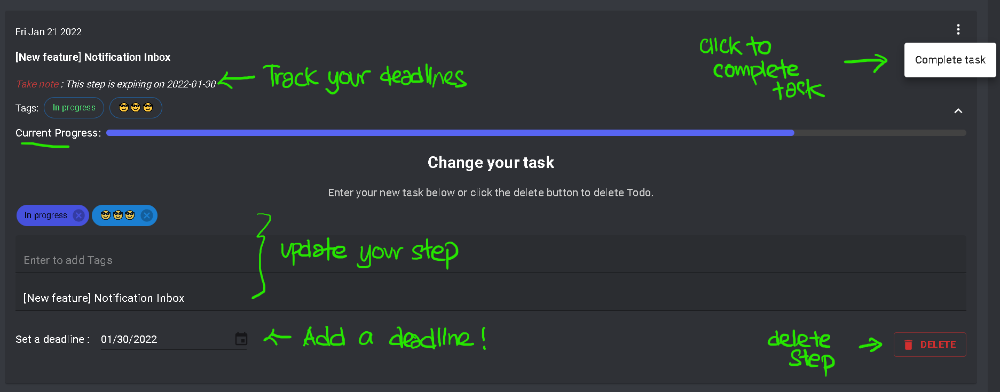

# The Fundamentals

## Welcome to the application

Welcome to the application! I'm glad to have you here.

When you enter the application for the first time, you will be prompted to log in with your credentials. Once authorized, you will be assigned a JWT token that will be saved to your local storage. This token is **important** for you to access other portions of the application as well as subsequent access during the lock-in period.

:::note
Since this is a Single Page Application, you can access the log-in and sign-up pages by navigating to the previous page. A “Log Out” button is provided in the top left corner for your convenience, although you are not required to log out before switching accounts.
:::

The Lock-in duration is 24 hours.

:::tip
Click the register button to register. Note that names must be longer than 8 characters and password has to be longer than 6 characters.
:::

## Groups

Groups are referred to as "topics" in your tasks. They can assist you in categorizing the tasks at hand.

To view your groups, simply open the sidebar (it should already be open by default, in which case you'll need to click on the hamburger menu in the upper left corner of your screen). To establish a new group, enter the title of your group at the bottom of the screen.

To delete or alter a group, click the settings icon next to the Group's title, which will open a modal component.

:::caution
This action is permanent so be careful with it!
:::

Follow the instructions there.

## Steps

If Groups are "topics", then you may treat Steps as "sub-topics". They can help to provide furthur clarity to the topic at hand.

If there are no current steps, then you should see a placeholder SVG (credits to Undraw.io) as well as a prompt to create a new step. Add any tags you wish to have on the first inputfield (remember to hit on enter after every tag), and navigate back to the next input box, enter your steps and press ENTER.

To complete your task, navigate to the vertical floating icon on the top right of the card, click on it and indicate that you wish to complete the task (refer to the image below).

Finally, to delete or update the step, click on the icon just right below the vertical floating icon and follow the instructions there

:::caution
This action is permanent so be careful with it!
:::

## Final Word

With that, you have now understood the basics of the application! Why not go explore it now? 😀😀
If you wish to, let's move on to see more features!
